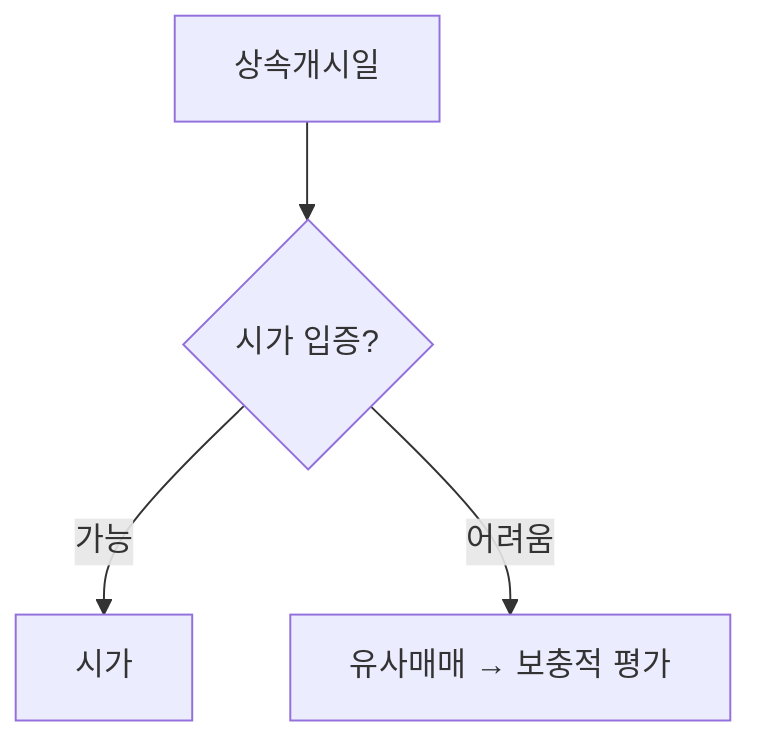

# 시각 요소 가이드

시각 요소는 장식이 아니라 **독자가 스캔하다 멈출 닻**이다.  
목적은 화려함이 아니라 **답에 더 빨리, 더 오래 닿게 하는 것**이다.

품질 울타리: `quality-standard.md` · 금형: `article-generation-prompt.md` · 2차 패스: `article-visual-enhance-prompt.md`

---

## 자동화 경계

| 기계 (프롬프트·2차 패스) | 사람 (검수·발행 전) |
|---|---|
| 마크다운 **표** | **PNG 인포그래픽 3장** (`static/images/`) |
| **요약·주의** 인용 블록 | 표·캡션 안 **사실·기준일** |
| **Mermaid** 흐름도 (초안·검수) | Cursor 등으로 **플랫 인포그래픽** 생성 → 한글·내용 검수 |
| 이미지 **alt·캡션 초안** | 저작권·출처 최종 확인 |

**원칙:** 마크다운으로 안전하게 찍을 수 있는 것은 기계에, 저작권·사실·판단이 걸린 것은 사람에.

---

## 글당 권장 분량 (~2,000자 기준, 가감 가능)

| 요소 | 권장 |
|---|---|
| 표 | **1~2개** |
| 핵심 요약 박스 | **1개** (서론 직후) |
| 주의 박스 | **0~1개** (본문 중간, 함정·실수) |
| **PNG 인포그래픽** | **3개** (흐름도 · 비교 · 상황/유형) |
| Mermaid | **0~1개** (초안용; 발행 시 1번 흐름도 PNG로 교체 권장) |

긴 문단만 이어지지 않게, **글자 벽 구간마다 닻 하나**를 둔다. 과다 시 로딩·흐름이 깨진다.

---

## 요약·주의 박스

Hugo 마크다운 인용 블록(`>`)으로 쓴다.

**핵심 요약** — 서론 직후, 결론 3줄 이내.

```markdown
> **핵심 요약**
>
> - 첫 번째 포인트
> - 두 번째 포인트
```

**주의** — 본문 중간, 흔한 실수·함정.

```markdown
> **주의**
>
> 인근 실거래가 있는데 공시가격만 고집하면 시가 단계와 충돌할 수 있습니다.
```

한 글에 요약+주의 **합쳐 2개 이내**. 남발하면 효과가 사라진다.

---

## 비교 표

헷갈리는 개념은 표로 나란히 둔다.

| 상황 | 권장 요소 |
|---|---|
| 두 개념·경로 비교 | 표 |
| 절차·단계 | 번호 목록 또는 Mermaid |
| 핵심 결론 | 요약 박스 |
| 복잡한 분기 | Mermaid 흐름도 |

표 안 **세율·날짜·금액**도 본문과 같이 YMYL 규칙을 따른다. 틀린 표는 틀린 본문보다 빠르게 퍼진다.

---

## 흐름도 — Mermaid 우선, PNG는 사람이 교체

### v0 (초안·검수 중)

본문에 **Mermaid 코드 블록**을 넣으면 Hugo가 페이지에서 렌더한다.

````markdown

````

Mermaid 아래에 **교체 예정 주석**과 캡션 초안을 붙인다.

```markdown
<!-- 이미지 교체 예정: static/images/inheritance-valuation-order-flow.png -->
<!-- alt 초안: 상속 부동산 평가 순서—시가, 유사매매, 보충적 평가 흐름 -->
*도식: 평가 순서는 시가 우선입니다 (2026년 7월 기준).*
```

### v1 (발행 직전, 권장)

1. Mermaid를 참고해 **직접 그린** PNG(네모·화살표)를 `static/images/`에 저장
2. 가로 **800~1200px**, 용량 **200KB 이하** 권장 (압축)
3. Mermaid 블록을 이미지로 **교체** (또는 발행 후 점진 교체)

```markdown

*도식: 평가 순서는 시가 우선입니다 (2026년 7월 기준).*
```

Hugo `static/images/` → URL `/appraisal-note/images/파일명.png`

**ASCII**는 Mermaid가 안 맞을 때만 짧게 쓴다. 장문 ASCII는 가독성이 떨어진다.

---

## 이미지 규칙 (PNG)

### 허용

1. **직접 만든** 개념 도식·흐름도
2. **CC0** 등 상업적 이용·수정 가능 (라이선스 직접 확인)
3. 공개 통계 수치를 **직접 그린** 단순 차트 + 출처·기준일 캡션

### 금지

- 국세청·홈택스 **화면 캡처**
- 네이버 부동산·증권사 앱 **스크린샷**
- 타사 **감정평가서** 스캔
- 구글 이미지 검색 **무단 사용**
- 특정 종목·물건 **투자 권유**처럼 읽히는 차트

출처가 애매하면 **쓰지 않는다**.

### alt·캡션

- **alt:** 그림을 한 문장으로 정직하게 설명 (키워드 자연스럽게 1회)
- **캡션:** 독자가 기억할 **한 줄 메시지** (빈 말 금지)
- 파일명: `inheritance-valuation-order-flow.png` (내용 영문, `IMG_2034` 금지)

---

## 감정평가 노트 예시 매핑

| 일반 원칙 | 이 블로그 |
|---|---|
| 비교 표 | 시가 vs 보충적 평가, 공시 신고 vs 감정 검토 |
| 흐름도 | 상속개시일 → 거래조회 → 시가/보충적 분기 |
| 주의 박스 | 「실거래 있는데 공시만」 함정 |
| 금지 이미지 | 거래소 차트 → 국세청·부동산 앱 캡처 |

---

## 검수 시 확인 (`quality-checklist.md` D절)

- [ ] 긴 문단만 3개 이상 연속되지 않는가
- [ ] 표·박스가 본문 사실과 일치하는가
- [ ] Mermaid가 의도대로 렌더되는가 (`hugo server -D`)
- [ ] PNG 교체 시 alt·캡션·용량(200KB 이하 권장)을 확인했는가
- [ ] 저작권·YMYL 위반 이미지가 없는가

---

## 워크플로 위치

```
초안 생성 (article-generation-prompt) — 표·박스·Mermaid 포함
    ↓
AI 리뷰 (article-ai-review-prompt)
    ↓
시각 2차 패스 (article-visual-enhance-prompt) — PNG 3장 생성·삽입
    ↓
Claim Log + quality-checklist (D. 시각 요소)
    ↓
PNG 3장 한글·내용 검수
    ↓
발행 (git push → GitHub Pages)
```
